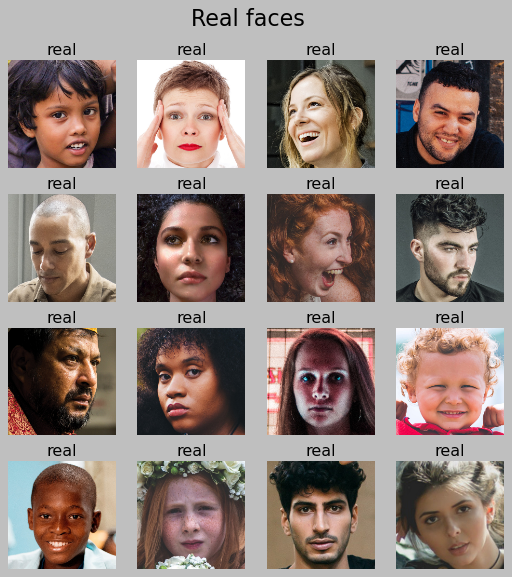
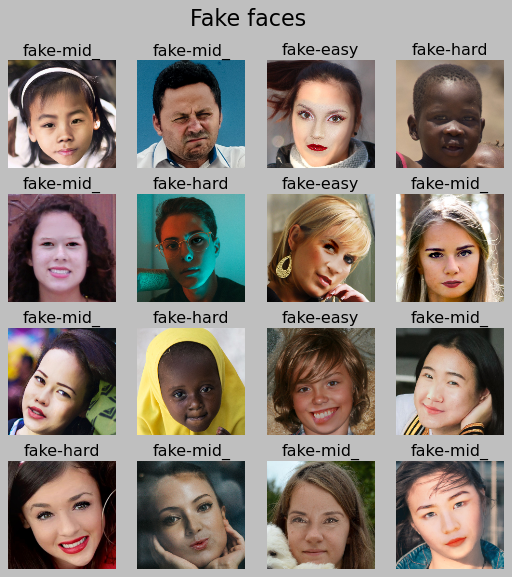

# FaceCheck
ML model for detecting if a face is AI generated or real

## Overview

In today's digital world, anyone can manipulate images and videos with relative ease. Distinguishing real faces from AI-generated ones has become increasingly crucial. 


FaceCheck is a AI image classifier that is trained on 1000 fake and real images to discern genuine faces from a synthetic one.

## Business Problem

There is a variety of problems that comes with facial image fabrication.

- Misinformation: Deepfakes can be used to fabricate news or spread fake news for political gain
- Financial fraud: Fake identities can be used to commit identity theft, open fraudulent accounts, and bypass security measures.
- Manipulation: Fake identities can be used to impersonal individuals and deceive audiences

FaceCheck equips individuals with the ability to detect and verify faces. FaceCheck will allow users to:

- Verify the authenticity of online profiles and interactions.
- Protect themselves from online scams and phishing attempts.
- Contribute to a safer and reliable online experience

## Data

The dataset comes from https://www.kaggle.com/datasets/ciplab/real-and-fake-face-detection/ .

Examples of real faces:



Fake faces are split by easy, medium, hard difficulty.

Examples of fake faces:



## Models

Models used include:

- Baseline model with 1 Dense layer 
- MobileNet v2 model
- VGG16 Model
- 2 Other models experimenting with different layers and hyper parameters

## Results:

**MobileNetv2** model had the best training accuracy, however all models had around 53% accuracy for the validation/test accuracy. 


More data is pnecessary. There is too much variance such as skin tone, accessories, facial expression, and angle.

## Future Steps

- Increase amount of training and testing data
- Continue to tune models
- Connect a front end app that allows users to upload a picture and get feedback immediately

## For More Information

Please review the full analysis in [the Jupyter Notebook](./Main.ipynb) or the [presentation](./Slides.pdf).

For any additional questions, please contact **Andy Shen - itsahaotian@gmail.com**

### Repository Structure

You are in the README.md. Main.ipynb contains the jupyter notebook that explains the data science steps for you to replicate. 'Slides.pdf' contains the Canva presentation. In 'data' you will be able to see the dataset I worked with. Likewise, 'Images' will contain images used in this 'README.md' generated from code and as well as from the web.

```
├── README.md                           <- The top-level README 
├── Main.ipynb                          <- documentation of analysis in Jupyter notebook
├── Slides.pdf                          <- PDF version of project presentation
├── data                                <- Both sourced externally and generated from code
└── images                              <- Both sourced externally and generated from code
```
